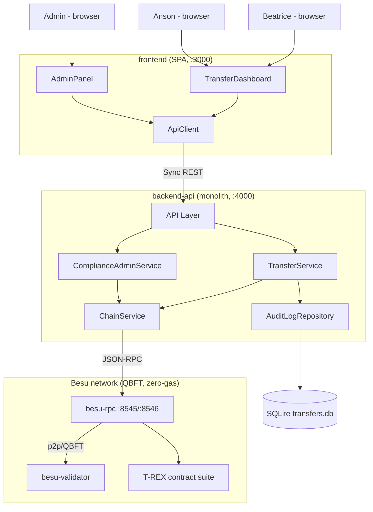
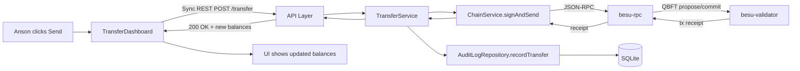
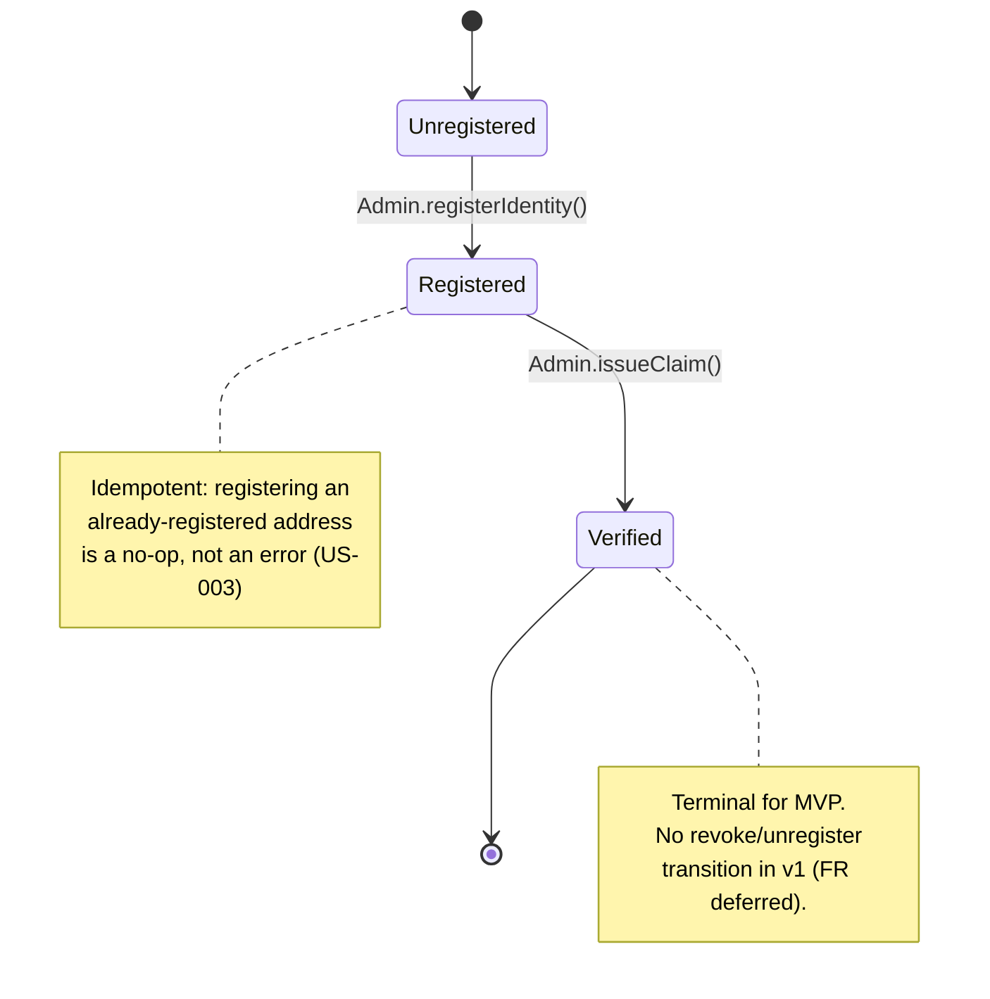
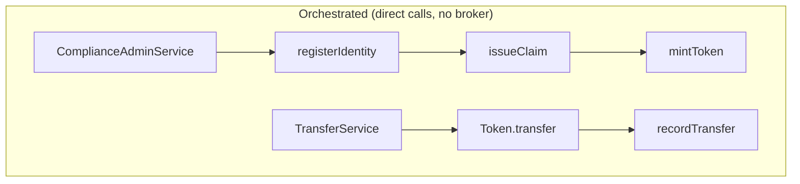
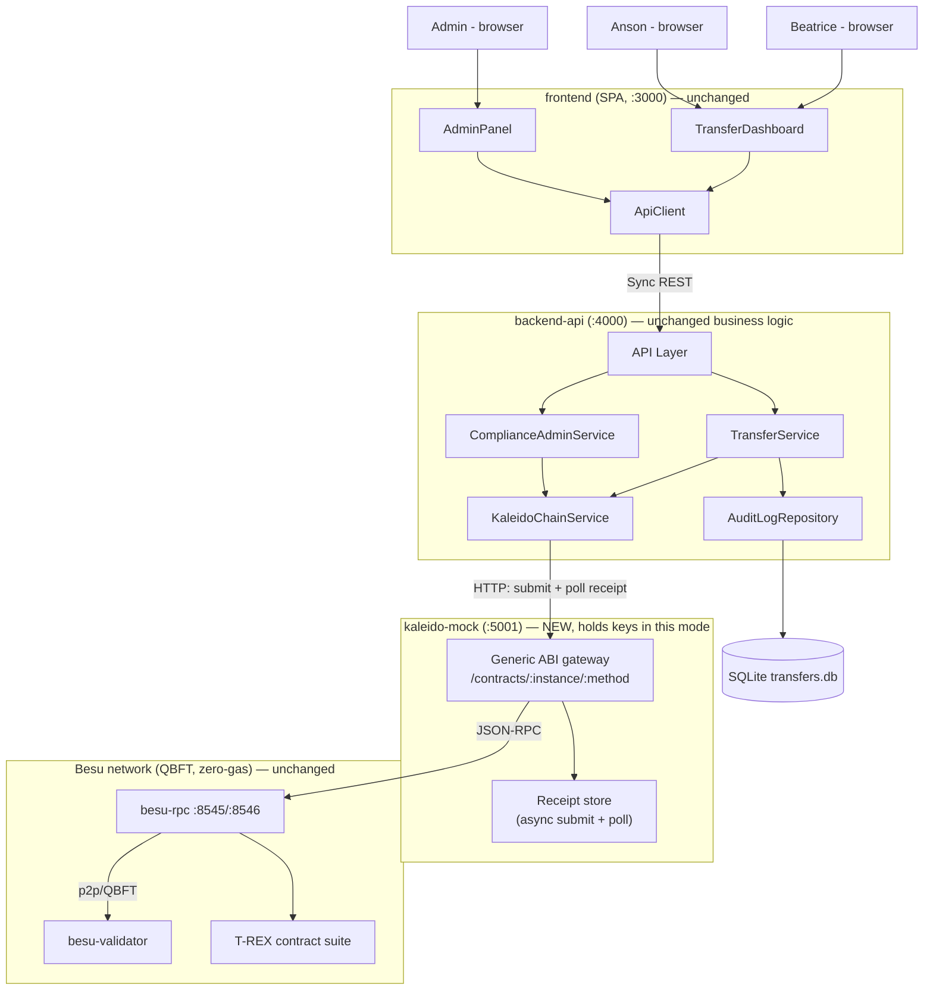

# Architecture — besu-digital-asset-demo

> **Owner:** Howin Ho · **Created:** 2026-09-14 · **Status:** Locked (post grill-me)

---

## §1 Overview

**Architecture style: Monolith** (backend) + a thin SPA frontend + a two-node blockchain infra tier. Rationale: solo project, greenfield PoC, no divergent scaling profiles between modules — a modular monolith or microservices split would add operational cost with no corresponding benefit at this scale (D-16, D-17).

**Deployment model:** 4 containers via Docker Compose:
- `besu-validator` — QBFT block producer, not exposed to host
- `besu-rpc` — non-validating full node, exposes JSON-RPC (`8545`) and WS (`8546`)
- `backend-api` — single Node/Express monolith, exposes REST (`4000`)
- `frontend` — React SPA served on `3000`, talks only to `backend-api`

**Data tier:**
| Store | Role | Owned by |
|---|---|---|
| Besu ledger (on-chain state) | Authoritative source of truth for identities, claims, and `DAT` balances | T-REX contract suite |
| SQLite (`transfers` table, file-based) | Local audit log of successful transfers | `backend-api` (`AuditLogRepository`) |

**External services:** None. Fully local, no third-party APIs, no email/SMS, no cloud dependency (D-15, D-16).

**Locked stack decisions:** see `docs/plan.md` D-01 (ERC-3643/T-REX), D-04 (QBFT single validator), D-05 (zero-gas), D-09 (backend holds keys), D-11 (SQLite). Rationale for each is not repeated here — see §9.

---

## §2 Modules and Capability Mapping

| # | Name | Capabilities owned | Data owned | Depth |
|---|---|---|---|---|
| 1 | **T-REX Contract Suite** (on-chain) | `Token`, `IdentityRegistry`, `IdentityRegistryStorage`, `ClaimTopicsRegistry`, `TrustedIssuersRegistry`, `ModularCompliance` | On-chain identity, claim, and balance state | deep |
| 2 | **ChainService** (backend module) | `signAndSend(txRequest, asIdentity)`, provider/signer lifecycle | None (stateless) | deep |
| 3 | **ComplianceAdminService** (backend module) | `registerIdentity`, `issueClaim`, `mintToken` | None (delegates to chain) | deep |
| 4 | **TransferService** (backend module) | `transfer(fromIdentity, toAddress, amount)` | None (delegates to chain + audit log) | deep |
| 5 | **AuditLogRepository** (backend module) | `recordTransfer`, `listTransfers` | SQLite `transfers` table | deep |
| 6 | **API Layer** (backend module, Express routes) | HTTP adapters over modules 2–5 | None | shallow |
| 7 | **Frontend Dashboard** (SPA) | `AdminPanel`, `TransferDashboard`, `ApiClient` | None (browser-only UI state) | shallow |

**MVP simplification block:**

| Component | MVP (ship this) | Phase N upgrade |
|---|---|---|
| Identity model | Wallet address used directly as the identity key (D-03) | Per-investor OnchainID proxy contracts (FR-13, deferred) |
| Key management | Demo private keys in backend server config (D-09) | Real wallet / HSM / KMS integration (FR-14, deferred) |
| Compliance rules | Single basic `ModularCompliance` module (verified/unverified only) | Country-restriction / max-holder-count modules (FR-15, deferred) |
| Network fault tolerance | Single validator (D-04) | Multi-validator QBFT set (FR-16, deferred) |

Net effect: MVP ships 4 containers, 1 on-chain contract suite, 5 backend modules, 1 frontend deployable — nothing else is active.

**Topology diagram:**

---

## §3 Integration Patterns Per Interaction

| Interaction | From → To | Pattern | Why this pattern |
|---|---|---|---|
| Dashboard actions | Frontend → Backend | Sync REST | Simple request/response, single consumer, no need for async (D-17) |
| Transaction submission | ChainService → besu-rpc | Sync REST (JSON-RPC over HTTP) | Besu's native interface; request must wait for a tx receipt to confirm success |
| Internal service calls | API Layer → CAS/TS → ChainService/AuditLogRepository | Direct call | All inside the same process (monolith); no boundary to cross |
| Audit log write | TransferService → AuditLogRepository | Direct call | Same process, same deployable, writes to local SQLite file |
| Block propagation | besu-rpc ↔ besu-validator | p2p (QBFT gossip) | Infra-level Besu protocol, not application code |

**Failure handling on critical paths:**

| Path | Failure mode | Behaviour |
|---|---|---|
| Frontend → Backend | Backend unreachable | UI shows "service unavailable" banner with retry button; no silent failure |
| ChainService → besu-rpc | RPC unreachable / timeout | Backend returns 503 + retry hint; transfer is not marked successful |
| ChainService → Contracts | Tx reverts (compliance check fails) | Typed `ComplianceRejectedError` surfaced through API as 4xx with a human-readable reason (FR-6, US-007); no audit log row written |
| TransferService → AuditLogRepository | SQLite write fails after on-chain success | On-chain transfer stands (not rolled back — chain is source of truth); error logged; balance still correct on next chain read; audit log entry can be backfilled manually (documented gap, R4-adjacent) |

**Integration critical path diagram — happy-path transfer:**

---

## §4 Event Catalog

> Not applicable — no event broker in this design. All interactions are synchronous REST or direct in-process calls (D-17).

---

## §5 Event Sourcing and CQRS — Scope and Rationale

- **Event sourcing:** Not used. The Besu ledger already provides an immutable, replayable log of every state-changing transaction — building a parallel event-sourced model in the backend would duplicate that guarantee for no benefit at this scale.
- **CQRS:** Not used. Balances are read live from the chain (`Token.balanceOf`); the only local read model is the SQLite audit log, queried directly with no separate write/read schema. Two users and one asset do not justify read/write separation.
- These are the correct calls for the current phase: the domain is small, the chain already gives strong consistency, and adding ES/CQRS would be scope creep against D-15/D-16 (solo PoC, minimum viable change).

**Primary entity lifecycle — Identity:**

**Decision rule:** A flow is orchestrated when a single owner must enforce ordering across steps with a shared invariant (e.g. "claim cannot be issued before registration"). A flow is choreographed when independent parties react to already-committed facts with no shared invariant to protect. This design has no choreographed flows — see §8.

---

## §6 Per-Module Rationale

**T-REX Contract Suite**
- Forces: ERC-3643 compliance (D-01) requires transfer restrictions enforced at the contract level, not just in application code, or the guarantee is meaningless.
- Alternative considered: implement compliance checks in the backend only (application-level gate before calling a plain ERC-20 `transfer`).
- Why rejected: application-level-only enforcement can be bypassed by anyone calling the contract directly; the whole point of ERC-3643 is that the contract itself refuses non-compliant transfers (D-01, D-03).

**ChainService**
- Forces: every other backend module needs to sign and send a transaction as one of three fixed identities; key handling must live in exactly one place (D-09).
- Alternative considered: let each service (CAS, TS) hold its own ethers.js signer instances directly.
- Why rejected: duplicating signer/provider/nonce logic across services risks nonce collisions and scatters key-handling code, making the "keys never leave the backend" guarantee (FR-8) harder to audit.

**ComplianceAdminService**
- Forces: onboarding is a fixed 3-step sequence (register → claim → mint) with an invariant (claim requires prior registration) that must be enforced somewhere.
- Alternative considered: let the frontend call three separate raw chain operations directly via ChainService.
- Why rejected: the ordering invariant would then live in the UI, which is the wrong layer — a future second UI (or a CLI script) would have to re-implement it.

**TransferService**
- Forces: a transfer is really two things — an on-chain call and an audit log write — and must present as one action to the caller.
- Alternative considered: have the API layer call ChainService and AuditLogRepository directly.
- Why rejected: that scatters the "log only on confirmed success" rule (US-006, US-007) into the HTTP layer, which should stay a thin adapter (shallow, per §2).

**AuditLogRepository**
- Forces: the audit log needs one place that knows the SQLite schema and query shape.
- Alternative considered: query SQLite directly from the API layer routes.
- Why rejected: would leak persistence details (schema, SQL) into HTTP handlers, making the schema harder to change later.

**API Layer**
- Forces: the frontend needs a stable HTTP contract that doesn't change when internal modules change.
- Alternative considered: expose ChainService/CAS/TS methods directly via an RPC-style bridge.
- Why rejected: REST is simpler to test, log, and reason about for a 6-endpoint surface (D-09, D-17); no need for anything more expressive.

**Frontend Dashboard**
- Forces: two distinct concerns (admin setup vs. peer-to-peer transfer) need to be visually separated for a demo audience to follow (D-08).
- Alternative considered: two separate frontend apps (admin app + user app).
- Why rejected: unnecessary operational overhead (2 containers instead of 1) for a solo demo where the same person drives both panels.

---

## §7 Integration Pattern Decisions and Rationale

**A. Sync REST (Frontend ↔ Backend)**
- Forces: single consumer (the dashboard), immediate feedback needed after every admin action or transfer.
- Alternative considered: GraphQL.
- Why rejected: a 6-endpoint surface with no nested/relational query needs does not justify a GraphQL layer.

**B. JSON-RPC over HTTP (ChainService ↔ besu-rpc)**
- Forces: this is Besu's native interface; no alternative transport exists for talking to the node.
- Alternative considered: WebSocket subscription for real-time block/event updates.
- Why rejected: MVP only needs request/response confirmation of a submitted tx, not a live event stream; WS is listed as a post-MVP option if the UI needs live updates without polling.

**C. Direct call (internal backend modules)**
- Forces: all modules run in the same process; there is no network boundary to cross.
- Alternative considered: internal message queue between modules (e.g. in-process event emitter).
- Why rejected: adds indirection with zero benefit — a monolith with 5 modules and no async requirement should just call functions directly (D-17).

---

## §8 Orchestration vs Choreography Deep Dive

**Decision rule:** Orchestrate when one owner must enforce a strict order and shared invariant across steps. Choreograph when steps are independent reactions to a fact that already happened, with no shared invariant and no natural single owner. This design has no scenario matching the choreography case — there is one backend, one owner for every multi-step flow, and no independent consumers reacting to events.

**What we orchestrate:**

1. **Onboarding flow** — owner: `ComplianceAdminService`
   - Step 1: `registerIdentity(address)` on `IdentityRegistry`
   - Step 2: `issueClaim(address)` on the claims layer, guarded by "must be registered first"
   - Step 3: `mintToken(address, amount)` on `Token`, guarded by "must be verified first"
   - Why mandatory: the contract-level invariants (claim requires registration, mint requires verification) are enforced on-chain, but the backend must present them as one coherent onboarding action and fail fast with a clear message rather than letting a caller skip a step.
   - Failure handling: any step failing aborts the sequence; no partial state is hidden from the caller (each step's result is returned).

2. **Transfer flow** — owner: `TransferService`
   - Step 1: call `Token.transfer()` via `ChainService`
   - Step 2: on confirmed receipt, write to `AuditLogRepository`
   - Why mandatory: the audit log must only ever reflect confirmed transfers (US-006/US-007) — this ordering is a hard invariant.
   - Failure handling: step 2 failing does not roll back step 1 (on-chain state can't be rolled back); this is a documented, accepted gap (§3 failure table).

**What we choreograph:** None. No event broker exists in this design (§4).

**Hybrid boundary:** N/A — no orchestrator acts as an external event source in this design.

**Failure modes table:**

| Pattern | Typical failure mode | Mitigation in this design |
|---|---|---|
| Orchestration | God-service coupling creep | Each orchestrator owns exactly one flow (onboarding or transfer); no shared orchestrator across unrelated flows |
| Choreography | Lost event in the middle | N/A — no events exist in this design |

**When to revisit:** If a future phase adds independent consumers reacting to transfers (e.g. a notification service, a real-time ledger dashboard for a third party), introduce an outbox + broker at that point rather than pre-building one now (YAGNI, consistent with D-17).

---

## §9 Tech Stack and Rationale

**Defaults:**

| Layer | Choice |
|---|---|
| Language/runtime | TypeScript (strict), Node.js 20 LTS |
| HTTP framework | Express |
| Contract dev/deploy | Solidity + Hardhat |
| Chain client | ethers.js |
| DB | SQLite (file-based, no ORM — direct `node:sqlite` (`DatabaseSync`) queries; schema is one table). Switched from `better-sqlite3` during Phase 3 — it needs a native C++ toolchain to compile that wasn't available locally; `node:sqlite` ships with Node itself, no native build |
| Frontend | React + Vite |
| Observability | Console/structured logs only (pino, post-MVP) |
| Secrets management | `.env.local` (gitignored) — demo private keys and contract addresses |
| Containers | Docker Compose, 4 services |

| # | Module / Service | Frontend | Backend | Data | Notable choices and rationale |
|---|---|---|---|---|---|
| 1 | Besu network | n/a | n/a | On-chain (Besu ledger) | QBFT (D-04), zero-gas (D-05) — enterprise-standard Besu consensus, no public-network spam risk to defend against |
| 2 | T-REX Contract Suite | n/a | Solidity, Hardhat | On-chain | Trimmed to 6 core contracts, no per-investor OnchainID (D-03) — full T-REX fidelity deferred (FR-13) |
| 3 | backend-api | n/a | Express, ethers.js, TS strict | SQLite | Holds all 3 demo private keys server-side (D-09); no ORM given single-table schema |
| 4 | frontend | React, Vite | n/a | n/a | Demo-mode identity switcher instead of MetaMask (D-07); talks only to backend-api, never to besu-rpc directly |

**Alternatives explicitly rejected:**
- **Microservices** — rejected: solo project, no divergent scaling/compliance/team-ownership needs (D-16, D-17).
- **PostgreSQL** — rejected: single-table audit log for a 2-user demo doesn't need a DB server; SQLite avoids a 5th container (D-11).
- **Kafka / Redis Streams** — rejected: no async fan-out, no background jobs; sync REST covers every interaction (D-17).
- **GraphQL** — rejected: 6 flat endpoints, single consumer, no nested query needs.
- **Next.js / SSR frontend** — rejected: pure client-side dashboard talking to a REST API; no SEO or server-rendering need.
- **Real MetaMask wallet integration** — rejected for v1: adds custom-network-add UX friction and multi-account-switching overhead for a solo demo operator (D-07); deferred (FR-14).
- **Full T-REX with per-investor OnchainID** — rejected for v1: multiplies deployment steps (3-4 extra contracts per identity) without changing what the demo proves (D-03); deferred (FR-13).

---

## §10 Security Measures

**Baseline controls:**
- No public network exposure — all 4 containers run on the Docker Compose internal network; only `frontend` (3000), `backend-api` (4000), and `besu-rpc` (8545/8546) ports are published to `localhost` for local development access.
- Private keys live only in `backend-api` server-side config (`.env.local`, gitignored) — never sent to the browser, never included in API responses or logs (FR-8).
- Input validation on all API routes (address format, amount as positive integer) before any chain call is attempted.
- Contract-level compliance checks are the real authorization boundary for transfers — the backend cannot bypass them even if it wanted to.

**Module / Service security table:**

| # | Module / Service | Authn (who calls it) | Authz (what they can do) | Data protection at rest | Boundary-specific threats and controls |
|---|---|---|---|---|---|
| 1 | `backend-api` (all routes) | None in MVP — anyone with access to `localhost:4000` | No role separation; any caller can hit admin or transfer endpoints | `.env.local` gitignored; SQLite file has no PII | **Accepted risk:** no auth layer. Only safe because the stack is bound to localhost / an internal Docker network with no public exposure (see accepted risks below) |
| 2 | `ChainService` | Called only by CAS/TS in-process | Signs only with the identity explicitly passed by the caller | Private keys in process memory + `.env.local` | Threat: key leakage via unhandled error stack traces — controlled by catching and sanitizing chain errors before they reach logs/responses |
| 3 | T-REX Contract Suite | Any address that calls the contract (public by nature of a blockchain) | Real authorization boundary: `ModularCompliance` + `IdentityRegistry` gate every transfer regardless of caller | On-chain, append-only, publicly readable within the private network | Threat: Admin key compromise = full control (can register/verify/mint anything) — accepted for PoC scope, no key rotation implemented |
| 4 | `frontend` | None | Purely a UI; server holds all authority | No sensitive data stored client-side | Threat: identity-switch dropdown lets anyone using the browser act as Anson or Beatrice — intentional for demo (D-07), disclaimed in README |

**Trust zones:**
- **Browser (frontend)** — untrusted input origin; holds no secrets.
- **Docker internal network** — trusted zone between `backend-api`, `besu-rpc`, `besu-validator`.
- **`backend-api` process** — the only zone holding private keys; the security boundary that actually matters in this design.
- **Besu ledger** — append-only, tamper-evident within the network, but not itself an access-control layer beyond what the T-REX contracts enforce.

**Cross-cutting controls tied to FRs:**
- FR-6 (compliance revert surfaced clearly) → prevents leaking raw RPC error internals to the UI.
- FR-8 (keys never exposed) → enforced in `ChainService` and error-handling middleware.
- FR-9 (demo-mode identity switch) → explicitly scoped as non-production auth (D-07, README disclaimer).

**Threats explicitly accepted as MVP risk:**
- No authentication/authorization on backend API routes — acceptable only because nothing is exposed beyond `localhost` / the Docker internal network (mitigated by network isolation, not by app-level auth). Mitigate before any future non-local deployment.
- No key rotation or HSM for the Admin/Anson/Beatrice demo keys — acceptable for a PoC with fictional identities and no real value at risk (D-15).
- Single validator (R1 in `docs/plan.md`) — no consensus-level fault tolerance.

---

## §11 Tests to Invest In

- **Contract-level compliance tests (Hardhat):** prove that `Token.transfer()` actually reverts for an unverified sender or recipient — this is the core guarantee of the whole design and must be proven at the contract layer, not just asserted by the UI (PD-2.3).
- **Service-layer unit tests (mocked ChainService):** prove `ComplianceAdminService` and `TransferService` enforce their invariants (claim requires registration; audit log only written on confirmed transfer) without needing a live chain for every test run.
- **Idempotency:** calling `registerIdentity` twice for the same address must not throw or double-register (US-003) — proves the onboarding flow is safe to retry from the UI.
- **Playwright E2E (3 specs, per D-13 / PD-4.2):**
  - `onboarding.spec` — proves the full stack (browser → API → chain) correctly onboards both identities and mints starting balance.
  - `happy-path-transfer.spec` — proves a confirmed transfer updates both balances and the audit log, round-tripping through every layer.
  - `compliance-rejection.spec` — proves a non-compliant transfer is rejected on-chain and the rejection is surfaced as a readable error in the UI, not a silent failure or a crash.
- A passing Playwright run is the strongest signal in this project: it proves contracts, backend, and frontend are correctly wired together end to end, not just that each layer works in isolation.

---

## §12 Diagrams

- Topology diagram — §2 (Mermaid, embedded)
- Integration critical path (happy-path transfer) — §3 (Mermaid, embedded)
- Identity lifecycle state machine — §5 (Mermaid, embedded)
- Orchestration diagram — §8 (Mermaid, embedded)
- Additional sequence diagrams for all flows: see `docs/use-cases.md`

---

## §13 Related Artifacts

- [docs/prd.md](prd.md) — product requirements, user stories, functional requirements
- [docs/plan.md](plan.md) — phase plan, decision log (D-01–D-17), risk register
- [docs/use-cases.md](use-cases.md) — end-to-end flows with sequence diagrams
- [docs/deliverables.md](deliverables.md) — phase-by-phase deliverables and "how to try it" guides
- [docs/kaleido-mock.md](kaleido-mock.md) — §14 below, in more detail

---

## §14 Addendum: Optional Kaleido-Mimic Transport (Post-MVP)

> Not part of the locked architecture in §1–§13, not a phase in `docs/plan.md` §4, and not gated by any decision D-01–D-24. Added afterward to demonstrate a different transport between the application and Besu — everything above this section remains the accurate description of the default, tested stack (`docker compose up -d`). Full detail: [docs/kaleido-mock.md](kaleido-mock.md).

**What changes:** `backend-api`'s `ChainService` (direct ethers.js, holds keys, D-09) gets a sibling, `KaleidoChainService`, that talks over HTTP to a new service, `kaleido-mock`, which holds the keys instead and exposes a generic ABI-driven REST gateway with async submission + receipt polling — the pattern that distinguishes a platform like Kaleido from a plain RPC wrapper. Selected via `CHAIN_TRANSPORT` env var; brought up via the `docker-compose.kaleido.yml` override, not a change to `docker-compose.yml`.

**What doesn't change:** `ComplianceAdminService`, `TransferService`, `AuditLogRepository`, all 6 REST routes, and the entire `frontend` — none of them know or care which transport is behind `ChainServiceLike`. This is the point being demonstrated: chain transport was already an interface boundary (§6's per-module rationale for `ChainService` — "key handling must live in exactly one place"), so swapping it out is a pure addition, not a modification, to the modules above. Verified by running the same 3 Playwright specs (§11) unmodified against both transports.

**Updated topology (this mode only):**

**Trade-off made visible:** a write action takes noticeably longer in this mode (~5s vs ~2-3s), a direct, observable consequence of `kaleido-mock`'s 1-second receipt-polling interval — async submission trades latency for not blocking the request thread on confirmation, which is exactly the trade-off a real platform like Kaleido makes at scale.

**Nonce-management pitfall recurs by design, not by accident:** `kaleido-mock` independently needed the same `ethers.NonceManager` + reset-on-failure fix as `backend-api`'s `ChainService` (§9's tech stack notes don't mention this because it surfaced during Phase 4 E2E testing, after §9 was written) — confirming it's inherent to "one process signs for multiple identities and submits transactions," not a one-off bug in a single module.
