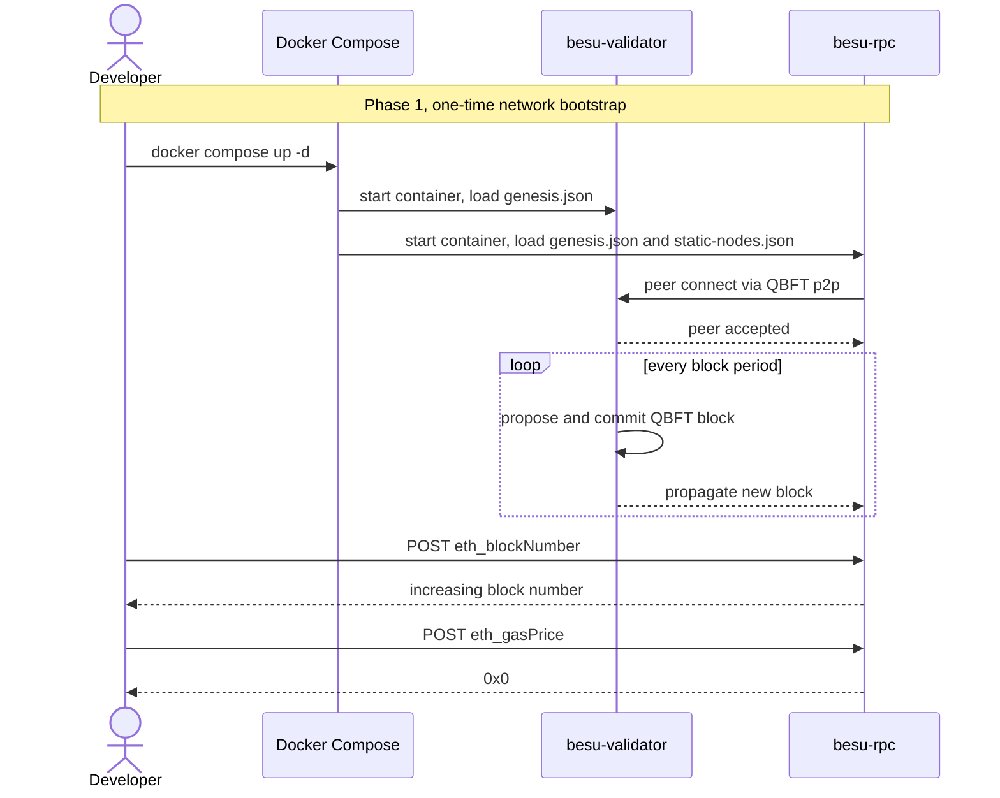
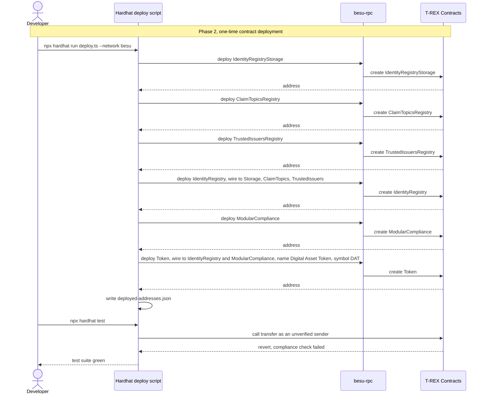
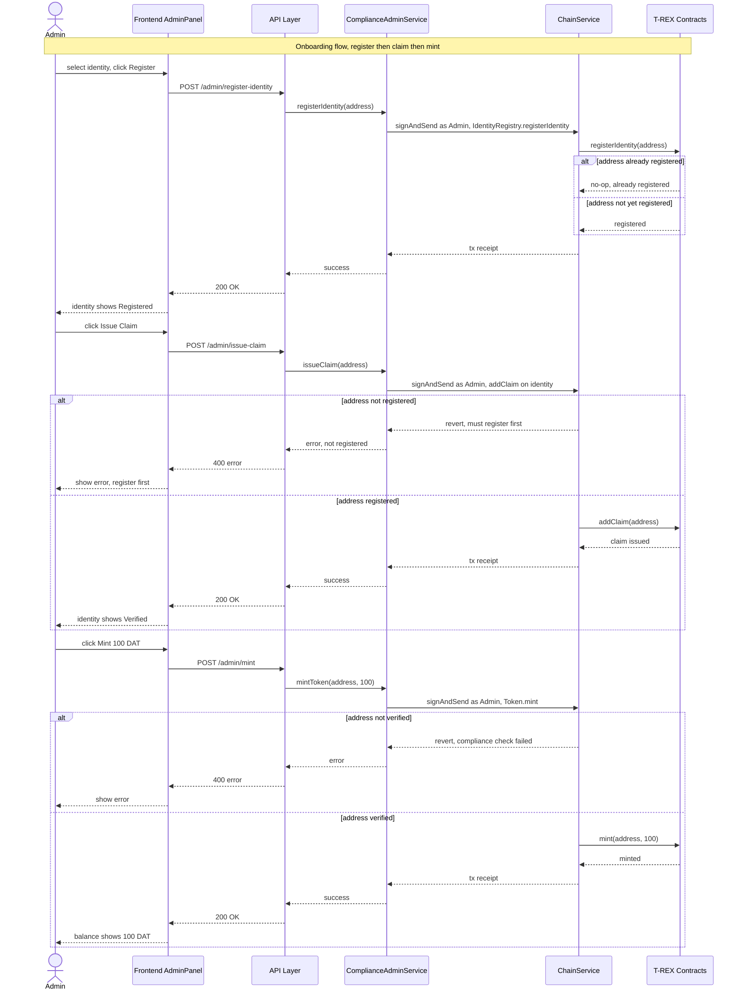
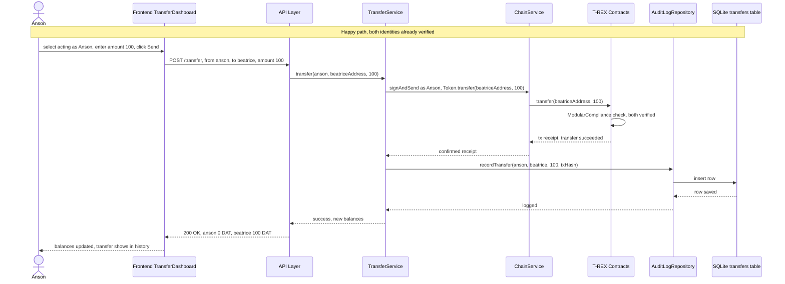
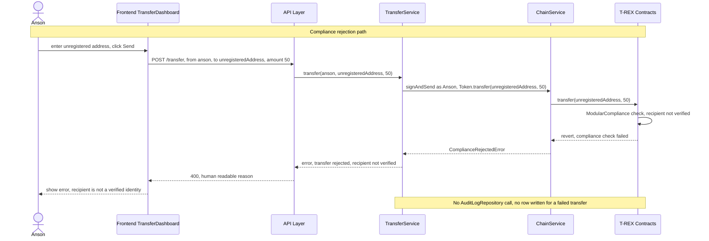
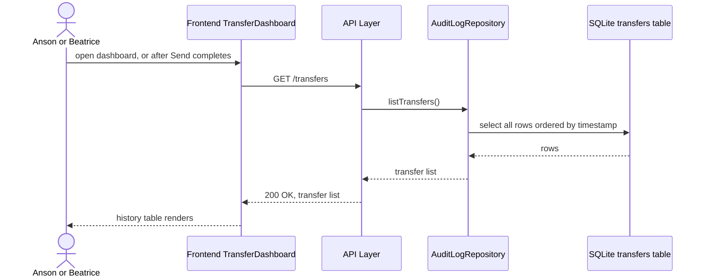
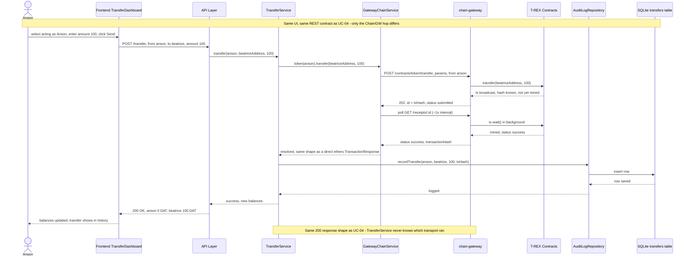

# Use Cases - besu-digital-asset-demo

> **Owner:** Howin Ho - **Created:** 2026-09-14 - **Status:** Locked (post grill-me)
> Companion docs: [prd.md](prd.md), [architecture.md](architecture.md), [plan.md](plan.md)

This document is the single reference for end-to-end interaction flows.

---

## Actors

| Actor | Role |
|---|---|
| Developer | Howin, operating Docker/Hardhat CLI during Phase 1-2 setup |
| Admin | Human operator using the dashboard Admin panel; plays Token Agent + Trusted Issuer roles (D-02) |
| Anson | Human demo identity; sender in the primary transfer use case |
| Beatrice | Human demo identity; recipient in the primary transfer use case |
| Frontend AdminPanel | Dashboard component for onboarding actions (architecture.md S2) |
| Frontend TransferDashboard | Dashboard component for identity switch, send, balance, history (architecture.md S2) |
| API Layer | Express REST routes in `backend-api` |
| ComplianceAdminService | Backend module - onboarding orchestration |
| TransferService | Backend module - transfer orchestration |
| ChainService | Backend module - signs and broadcasts transactions |
| AuditLogRepository | Backend module - SQLite persistence |
| T-REX Contracts | On-chain contract suite (IdentityRegistry, ModularCompliance, Token, etc.) |
| besu-rpc | Besu non-validating full node, JSON-RPC endpoint |
| besu-validator | Besu QBFT block producer |

No external systems are involved - this is a fully local system (D-15, D-21, D-23).

> **Post-MVP addendum (UC-07 below):** adds one more actor, `chain-gateway`, an optional alternate transport for `ChainService`'s role — not part of the locked actor set above. See [chain-gateway.md](chain-gateway.md).

---

## UC-01: Developer Stands Up the Besu Network

**Goal:** A live, peered, block-producing QBFT network is reachable via JSON-RPC.

**Trigger:** Developer runs `docker compose up -d` after generating the QBFT genesis config.

**Notes:**
- Depends on D-04 (QBFT, single validator) and D-05 (zero-gas network).
- Corresponds to PRD US-001 and plan.md Phase 1 (M1.1, M1.2) exit gates.
- `besu-validator` is never exposed to the host - only `besu-rpc` is (architecture.md S1).
- Not a UI flow - no Playwright coverage; verified by the `curl` gates in plan.md Phase 1.

---

## UC-02: Developer Deploys the T-REX Contract Suite

**Goal:** All six trimmed T-REX contracts are deployed and wired together, and the compliance guarantee is proven by test.

**Trigger:** Developer runs the Hardhat deploy script against the live Phase 1 network.

**Notes:**
- Depends on D-01 (ERC-3643/T-REX) and D-03 (trimmed suite, no per-investor OnchainID).
- Corresponds to PRD US-002 and plan.md Phase 2 exit gate; the revert assertion is the anti-gate check.
- `deployed-addresses.json` is the coupling artifact Phase 3 depends on (plan.md S5).
- Not a UI flow - no Playwright coverage; verified by `npx hardhat test` in plan.md Phase 2.

---

## UC-03: Admin Onboards an Identity

**Goal:** A demo identity (Anson or Beatrice) becomes registered, verified, and holds a starting `DAT` balance.

**Trigger:** Admin selects an identity in the Admin panel and works through Register -> Issue Claim -> Mint.

**Notes:**
- Depends on D-02 (single Admin = Token Agent + Trusted Issuer) and D-08 (Admin panel lives in the same dashboard).
- Corresponds to PRD US-003, US-004, US-005 and the orchestrated onboarding flow in architecture.md S8.
- Idempotent registration is required (US-003 acceptance criteria) - registering twice must not error.
- Playwright coverage: `tests/onboarding.spec.ts` - covers the full happy path (register, claim, mint for both identities) per D-13.

---

## UC-04: Anson Pays Beatrice (Happy Path)

**Goal:** `DAT` balance moves from Anson to Beatrice and the transfer is recorded in the audit log.

**Trigger:** Anson (selected as the acting identity) enters an amount and clicks Send.

**Notes:**
- Depends on D-05 (zero-gas, so Anson needs no native currency to transact) and D-07 (demo-mode identity switch, no MetaMask signature prompt).
- Corresponds to PRD US-006 and this is the North Star metric flow in plan.md S6.
- The audit log write is best-effort after confirmation - see architecture.md S3 failure table for what happens if it fails.
- Playwright coverage: `tests/happy-path-transfer.spec.ts` - covers the full happy path per D-13.

---

## UC-05: Anson Attempts Transfer to an Unverified Address

**Goal:** The system refuses the transfer and shows a clear error, proving the ERC-3643 compliance guarantee holds even when triggered from the UI.

**Trigger:** Anson enters an address that Admin never onboarded and clicks Send.

**Notes:**
- Depends on D-01 (contract-level enforcement is the real authorization boundary, per architecture.md S10) and FR-6 (revert must be surfaced clearly, not as raw RPC error text).
- Corresponds to PRD US-007. This is the flow that proves the whole ERC-3643 investment (D-01) was worth it.
- Cross-references plan.md R1-adjacent anti-gate: if this path cannot be made to work, do not proceed past Phase 2.
- Playwright coverage: `tests/compliance-rejection.spec.ts` - covers this alt/error path specifically per D-13.

---

## UC-06: User Views Transfer History

**Goal:** Anson or Beatrice can see past successful transfers without leaving the dashboard.

**Trigger:** User opens the Transfer Dashboard, or a transfer just completed.

**Notes:**
- Basic listing is MVP (PRD US-011); client-side filtering is Post-MVP (FR-11, not yet built).
- Depends on D-10/D-11 (SQLite audit log is the source for this view, not a live chain event scan).
- Playwright coverage: implicitly exercised as part of `tests/happy-path-transfer.spec.ts` (asserting the history table updates after a send), per D-13's acceptance criteria for US-006. No dedicated spec file - flagged here as optional test backlog if history-view regressions become a concern on their own.

---

## UC-07 (Post-MVP Addendum): Anson Pays Beatrice via the Chain Gateway Transport

> Not part of the locked MVP flows above (UC-01–UC-06) - added after Phase 4 closed, to demonstrate an alternate transport. See [chain-gateway.md](chain-gateway.md), [architecture.md](architecture.md) S14.

**Goal:** Same outcome as UC-04 (balance moves, audit log records it) but routed through `chain-gateway`'s generic ABI gateway with async submission + receipt polling, instead of `ChainService` signing and broadcasting directly.

**Trigger:** Same as UC-04 - Anson enters an amount and clicks Send. The stack is running with the `docker-compose.gateway.yml` override active (`CHAIN_TRANSPORT=gateway`).

**Notes:**
- Everything from `API Layer` down through `Audit`/`DB` is byte-for-byte the same code path as UC-04 - only `Chain`'s implementation and the new `GW` hop differ.
- Observable difference: end-to-end latency is higher (~5s vs ~2-3s for UC-04), from the receipt-polling interval - this is the async-transport trade-off made visible, not a regression.
- The compliance-rejection equivalent of UC-05 fails *faster* in this mode (~0.1s): the revert happens during `eth_estimateGas`, before `GW` ever broadcasts a transaction, so it returns a synchronous 400 with no receipt ever created - see `chain-gateway.md` for why.
- Playwright coverage: the same `tests/happy-path-transfer.spec.ts` from UC-04 passes unmodified against this transport - no dedicated spec, since the point is that the test shouldn't need to know the difference.
